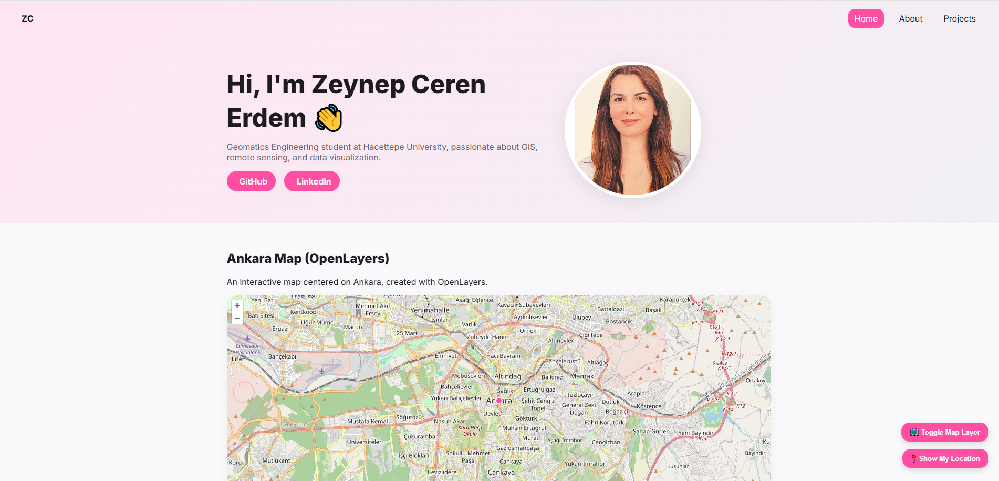

#  Personal Web Page – Zeynep Ceren Erdem

This website was created as part of the **GMT458 – Web GIS** course at **Hacettepe University, Department of Geomatics Engineering**.  
The main goal of the project is to design a personal portfolio website that introduces my background, interests, and academic projects in a professional and creative way.

---

##  Website Structure

| Page | Description |
|------|--------------|
| **Home** | A brief introduction, social links (LinkedIn & GitHub), and an interactive OpenLayers map. |
| **About** | Personal background, skills visualized with a Doughnut Chart, downloadable CV, and a personal photo grid. |
| **Projects** | Three academic projects with accessible reports and downloadable project files. |

---

##  Technologies Used

- **HTML / CSS / JavaScript** – For structure, design, and interactivity  
- **OpenLayers** – For embedding interactive web maps  
- **Chart.js** – For skill visualization  
- **QGIS / Python** – For spatial data processing and map creation  

---

##  Project Structure

personal-web-page-zecereve/
│
├── index.html
├── about.html
├── projects.html
├── styles.css
├── script.js
│
├── images/ → Personal and project-related images
├── projects/ → Project folders (GNSS, TR8, Remote Sensing)
│ ├── GNSS/
│ ├── TR8/
│ └── beytepe_modified/
└── README.md
---

##  Use of Artificial Intelligence

During the preparation of this project, **AI-based tools (ChatGPT)** were used for limited technical assistance.  
AI support was applied only for:Resolving syntax and layout issues, improving code readability and structure, providing guidance on OpenLayers integration and animation logic  

All data, design decisions, and written content were produced and finalized by me.  
**Total AI-assisted work time:** a few hours  
**Purpose:** to enhance learning and technical precision.

---

##  Preview

_Add a screenshot of your homepage as `images/website.png`._

---

##  Project Summary

| Project | Description | File |
|----------|--------------|------|
| **GNSS SPP – MERS Station** | GPS C/A code observation processing using SP3 data and Least Squares method | `projects/GNSS/gnss.pdf` |
| **Remote Sensing – Beytepe Lab 01** | Satellite image processing and land-cover classification | `projects/beytepe_modified/ceren1.pdf` |
| **TR8 Thematic Map Project** | Choropleth and dot map visualization for TR8 region (2021) population and motor vehicle data | `projects/TR8/TR8_Report.pdf` |

---

##  Note

This project was developed as an **individual assignment** for the GMT458 course.  
The downloadable CV available on the **About** page represents an earlier version of my résumé created for course purposes.  
It is **not my latest professional CV**, and some details (such as recent experience and updated skills) may differ from my current profile.